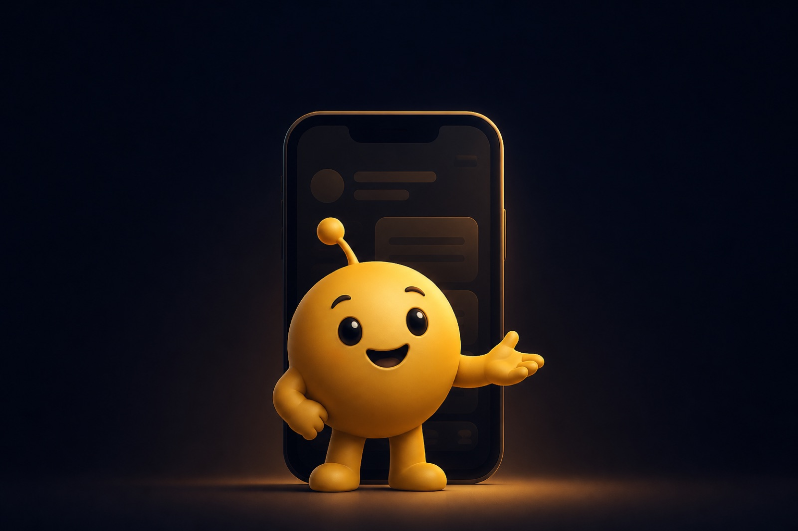
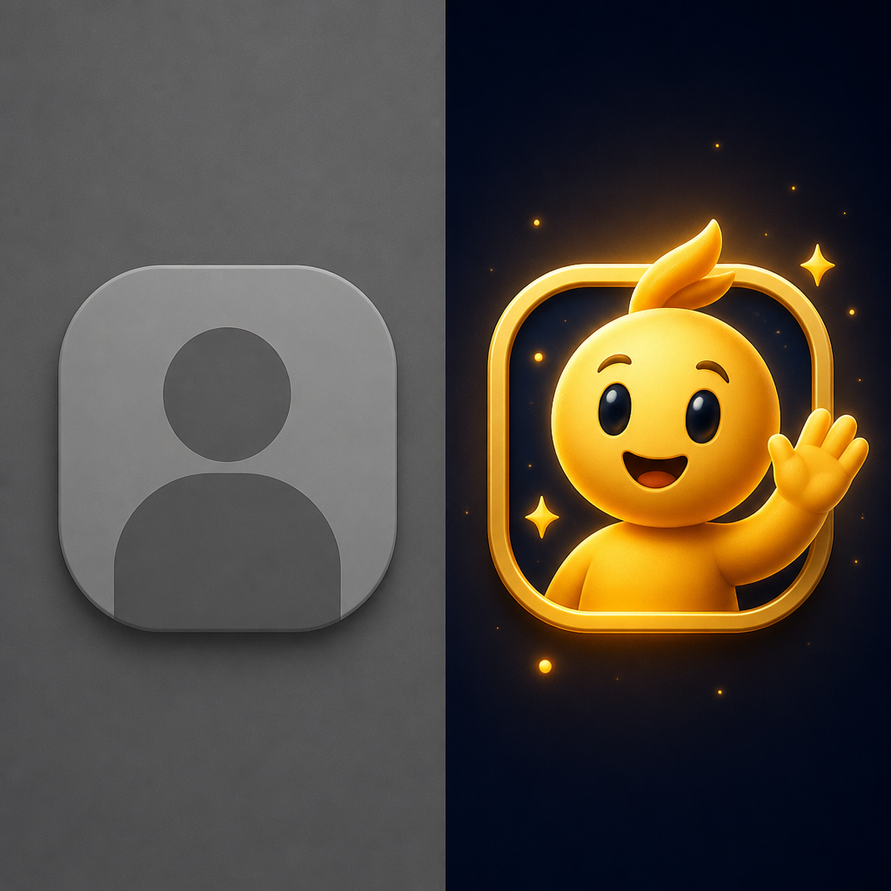

# Why App Mascots Matter (And How to Build One Your Users Remember)

Open your phone and scroll for eight seconds. Try naming the logos you just saw.

Most of them vanish. Utility apps are especially good at this disappearing act. They solve real jobs and still feel interchangeable because the UI speaks in gray chrome and stock glyphs. Someone finishes a task, closes the tab, and carries no mental hook into tomorrow.

A face changes the odds. People are wired to notice faces; brand teams have been exploiting that wiring for a century, from cereal boxes to insurance lizards. Freddie for Mailchimp. Duo for Duolingo. The Geico gecko in a category nobody asked to love. Those brands did not sprinkle cuteness for decoration’s sake. They installed a reusable actor who could carry tone across ads, product screens, and support emails.

If you ship software now, the shelf is crowded with lookalike dashboards and “AI wrapper” skins. Feature lists get copied. A lived-in character is harder to xerox, because it accumulates small lore over time: how it waits, how it celebrates, how it apologizes after a failed payment.

That is what a serious app mascot strategy is betting on. Recognition that compounds.

## What an app mascot actually is

An app mascot is a designed persona that represents the product across marketing and product surfaces. It keeps a stable silhouette, a limited emotional vocabulary, and a clear job in the experience: coach, companion, guide, or occasional hype-person when the user ships something hard.

Plenty of things get mislabeled as mascots. A cute animal dropped on a landing page once, then abandoned. A celebrity face rented for a quarter. A generative avatar that redraws itself every time the model rolls new dice. Those can be fun assets. They are not a system.

System1 calls the advertising cousin of this idea a **fluent device**: a fictitious character used as the primary vehicle for drama across more than one execution. In product work, fluency means the same creature can show up in onboarding, push copy, empty states, and a launch video without the team reinventing proportions every sprint.

The constraints that separate a real brand character from clip art are boring on purpose:

- Readable silhouette around 48 pixels
- Palette that survives dark mode and light mode
- Gestures mapped to product states (idle, success, error, waiting)
- Personality that matches how the company already talks to users

When those hold, the mascot starts behaving like a **distinctive brand asset**. People can recognize it with incomplete information, the way you spot a friend from the back of their head in a crowd.

## The research case for brand characters and fluent devices

Cute is subjective. Budgets are finite. Fair pushback.

System1’s work with the IPA DataMINE archive found that long-term campaigns built around character fluent devices were more likely to deliver large business effects than campaigns without them. Coverage of that research commonly cites roughly **30% higher odds of profit gain**, **37% higher odds of market share gain**, and **27% higher odds of customer gain**. Orlando Wood and colleagues have argued for years that characters help build long-term memory structures and raise emotional response, which improves how far media spend actually goes.

Meanwhile, use of those characters declined. Scarcity is useful. If two competitors in your category run a coherent character and twelve do not, your stage is quieter than you think.

Duolingo’s public growth storytelling has repeatedly credited the green owl with engagement effects, including daily-active lifts tied to putting Duo into notifications. Exact percentages shift with the reporting year, so treat any single number as time-bound. The qualitative lesson holds: a character in the notification tray feels like a nudge from someone, while a generic system ping feels like spam with better typography.

Academic work points in a similar direction. Reddy and Sathish (2023) studied mascot endorsement strategies and reported positive associations among brand awareness, personification, self-congruency, attitude toward ads, and purchase intention. Other applied studies on animated brand characters keep landing on attraction, trust, and nostalgia as levers for awareness.

Nobody serious is arguing that every fintech needs a cartoon raccoon. The claim is narrower and more useful: recurring characters are unusually good at encoding brand into memory. Apps that treat the mascot as a one-week launch stunt throw that encoding away.

## How mascots reshape product UX

Product teams already fight cognitive load with tooltips and empty-state copy. Users skip the tooltips. Empty states still feel like a vacant room with fluorescent lighting.

A mascot gives the room a host.

**Onboarding.** Identity crystallizes in the first session. A character who welcomes, points, and waits can soften permission screens without turning setup into a cartoon. Keep motion brief. Respect `prefers-reduced-motion`. Recognition beats spectacle.

**Empty states.** “No projects yet” is a dead end. Copy like “Your studio is waiting—make the first one,” paired with a patient pose, is an invitation. The character absorbs the awkward silence.

**Success and celebration.** Habit products live on micro-rewards. A consistent celebrate pose trains faster recognition than a generic confetti Lottie borrowed from a UI kit.

**Errors and recovery.** Teams get squeamish here. They fear looking unserious. A gently concerned expression plus clear recovery copy can soften blame without clowning a failed charge. A winking raccoon on a payment-error screen will destroy trust. Match the gravity of the moment.

**Loading.** Perceived wait shrinks when attention has a focal point. A light idle loop often beats a bare spinner, as long as the file stays small.

Web and native play by the same placement rules. Discipline matters more than platform.

## Silhouette, lexicon, and emotional range

Start with the silhouette test. Reduce the character to a black shape. If the outline collapses into a potato, the mascot will fail as a favicon and as an avatar.

Then define a **lexicon**: the small set of expressions and props the character may use. Wide eyes for surprise. Soft brows for concern. A prop kit tied to the product metaphor (mic for speech coaching, lantern for ritual apps, antenna for a robot tutor). Unlimited props create costume chaos. A tight kit creates signature.

Emotional range should cover the product states you ship and stop before the brand voice breaks. A meditation app rarely needs a rage face. A competitive game might.

Treat color like design tokens. Map fills to theme variables where you can, so seasonal campaigns and accessibility themes do not force a full redraw. Studios that already think in theme contracts (including the swappable palettes in [MascotAI](https://appmascot.ai)) make later iteration less painful.

Lock proportions early. If week-one Duo had been a different owl every sprint, Duolingo would have trained forgetfulness.

## Formats that work in production

Marketing falls in love with glossy hero renders. Engineering needs assets that composite cleanly over UI, scale without mush, and leave the main thread alone.

**Raster PNGs** still win for push icons and some store assets. Keep a transparent master.

**Video with alpha** (transparent WebM, HEVC where supported) suits richer onboarding moments, with static fallbacks for unfriendly environments.

**Lottie and Rive** earn their keep when you need interactive state machines driven by app events.

**SVG gesture packs** remain underused for product work, which is odd, because vectors stay crisp on every density, parts can toggle, and themes can recolor through CSS variables. File weight stays manageable if you avoid nested filter soup. An animated SVG idle pose in an empty state is often enough. You do not need a 4K render of the character hugging a credit card.

The strategic question is whether you are buying a single illustration or a **pose system**. Single illustrations age into nostalgia posters. Pose systems become product infrastructure.

That gap still trips a lot of “AI mascot generator” workflows. They emit a pretty still. Two weeks later the team needs writing, celebrating, apologizing, and waving, and the still cannot stretch. Exportable pose packs (the model behind [MascotAI](https://appmascot.ai)’s studios) treat the character as a kit from day one: gestures, themes, parts, downloadable SVG that can live in a repo.

Ship what your surfaces require. A settings page that needed a quiet nod does not need a cinematic loop.

## Placement map: ten surfaces that compound memory

If the mascot only lives on the homepage hero, you built a billboard. Stretch it across the product so memory compounds.

1. **App icon / mark** — high risk, high reward; silhouette must be unmistakable
2. **Marketing hero and launch video** — first public impression
3. **Onboarding steps** — guidance without walls of text
4. **Empty states** — invitation instead of vacancy
5. **Loading / waiting** — something for attention to hold
6. **Success moments** — reinforcement
7. **Error and offline screens** — empathy with clarity
8. **Push and in-app notifications** — Duo’s famous territory; tone carefully
9. **Progress and streaks** — habit scaffolding
10. **Help, docs, and status pages** — continuity when something breaks

Duolingo-scale brands run most of this map. Indie apps can start with three: onboarding, empty, success. Expand when the character’s grammar feels settled.

A full gesture set bought or generated once (including marketplace packs) keeps those ten surfaces from becoming a redesign project every quarter.

## Failure modes that waste the budget

**Cute without utility.** The mascot shows up, says nothing useful, and steals focus from the primary button. Cut it or give it a job.

**Inconsistency.** Marketing runs a 3D creature; product ships a flat cousin; social invents a third. Users sense the fracture even if they cannot name it. One model sheet. One proportion sheet. Enforce both.

**Motion fatigue.** Constant bouncing reads as anxiety. Prefer stillness with occasional accents. Honor reduced-motion preferences without apology.

**Tone mismatch.** A solemn banking product with a slapstick frog feels like a costume party in the vault. Change the frog or change the brief.

**Format mismatch.** Opaque MP4 on a light UI leaves a black slab. GIFs in iOS rich push freeze. Test on device, not only in Figma.

**Over-generation.** Prompting fifty random creatures and picking the funniest produces a mascot with no product metaphor. Brief first. Generate second. Cull hard.

## Building a mascot system on a startup timeline

The classic path still works when you have money and months: hire a character designer, iterate, commission pose packs, hand assets to engineering, discover half the poses clash with the chrome, re-commission. Beautiful outcomes come from that loop.

Many teams do not have that runway.

A workable modern path looks like this:

1. Write a short product brief (category, audience, emotional job, palette, hard nos).
2. Lock a base character before exploding into poses.
3. Enumerate poses you will actually ship: idle, welcome, success, error, celebrate, plus a few category-specific beats.
4. Export in formats your stack can host: SVG packs for product, PNG for push, short clips for launch.
5. Drop the character into real screens early (dark mode, small sizes, next to dense tables).
6. Iterate themes and parts without redrawing the whole creature.

Interactive example studios help teams feel the craft before they commit. [MascotAI](https://appmascot.ai) publishes live studios you can click through with no account, then lets you generate from a brief or pull a ready pack from the marketplace when you want ownership without starting from a blank canvas. The value is compression: less distance between “we should have a mascot” and “we have a system in the repo.”

Token-metered generation helps operationally because you see cost before you burn a sprint exploring dead ends. Craft judgment still belongs to the human who rejects the wrong eyes and keeps the right silhouette.

## Naming your mascot so people can find you later

Search engines do not rank vibes, but people search for characters they remember. “Duolingo owl” and “Mailchimp monkey” are query shapes born from consistency. If your mascot has a name, use that name the same way in UI copy, release notes, and social.

When you write about your product, use the language your buyers already type: app mascot, brand character, animated SVG mascot, how to create an app mascot. Keep the character recognizable across screenshots and launch galleries. Product Hunt cards with a coherent creature beat abstract gradient tiles because the eye has a subject.

Inconsistent naming fragments search equity the same way inconsistent logos fragment brand equity.

## FAQ

### What is an app mascot?

An app mascot is a recurring brand character used inside and around a product (onboarding, empty states, marketing, notifications) with consistent proportions and an emotional range tied to real product states.

### Why do apps use mascots?

Because faces and personas are easier to remember than abstract logos. Research on fluent devices and brand mascots links recurring characters to stronger memory encoding and, in advertising datasets, higher odds of long-term commercial effects.

### How do I create an app mascot?

Write a brief, lock a silhouette, ship a small pose set for the surfaces you already have, then expand. You can commission an illustrator or use a studio that exports a pose system (for example [MascotAI](https://appmascot.ai)) so you are not stuck with a single pretty still.

### What file format should a product mascot use?

It depends on the surface. Transparent PNG for push and icons. SVG packs for crisp in-app UI and themeability. Lottie or Rive for interactive state machines. Transparent video for heavier onboarding moments. Match format to placement.

### Do SaaS products need an animated mascot?

Need is a strong word. Many SaaS products win on clarity alone. Animated mascots help when the product wants warmth, guidance, or habit reinforcement. Static consistent characters still beat inconsistent random illustrations.

### What is the difference between a brand mascot and an AI avatar?

A brand mascot is a controlled system with locked design rules. An AI avatar that regenerates differently each time trades consistency for novelty. Novelty is fine for toys. Brands need recognizability.

## A practical brief you can fill out this week

Steal this scaffold. Keep it ugly and honest.

- **Product one-liner:** what you ship in one sentence
- **Audience:** who opens the app on a tired Tuesday
- **Job of the mascot:** guide / celebrate / reassure / teach
- **Metaphor:** what object or creature belongs to the domain without becoming a cliché trap
- **Palette:** three fills + stage color; note dark-mode behavior
- **Must-have poses (max 8 for v1):** idle, welcome, success, error, celebrate, plus category beats
- **Hard bans:** styles, tropes, or moods that would embarrass the brand
- **Surfaces for v1:** pick three from the placement map above
- **Format targets:** SVG pack / PNG / short clip
- **Success metric:** e.g. activation on onboarding step 2, or empty-state CTA click

Fill it before you open any generator. Then generate or commission against the brief. If a candidate fails the silhouette test or the Tuesday-tired-user test, kill it early.

When you want to move from brief to a full gesture studio quickly, run that same brief through [MascotAI](https://appmascot.ai), pick a direction, and export the pack into design and engineering. Keep the brief in your hand while you judge. Tools accelerate production. Taste still decides what ships.

## Where to go from here

Apps compete on features until features converge. They compete on distribution until channels saturate. Personality stays unevenly distributed, which is why a coherent mascot still feels rare when you meet one in a real product.

The fluent-device research keeps pointing at memory and long-term commercial effects. Product UX keeps offering concrete slots (onboarding, empty states, recovery) where a character can reduce friction if you treat it as a pose system with formats and placements, rather than a mascot-of-the-month.

Ship a face that can idle, celebrate, and recover with the same bones. Put it where users hesitate. Keep the silhouette honest. Expand the surface map after the character earns trust.

Try the live studios and build from a short brief at [appmascot.ai](https://appmascot.ai).

## References

1. System1 fluent devices research and IPA DataMINE campaign analyses — [System1 fluent devices](https://pages.system1research.com/fluent_devices), [Fluent Devices 2 (digital)](https://system1group.com/blog/fluent-devices-2-this-time-its-digital)
2. System1 Group, Fluent Devices case study PDF — [download](https://cdn2.hubspot.net/hubfs/2235762/Case%20Studies/Fluent%20Devices%20Case%20Study%20Format-1%20(1).pdf)
3. Reddy, V. V. B., & Sathish, A. S. (2023). Creating Connections Through Characters: A Study of Brand Mascots and Their Influence on Consumer Purchase Intentions. *Advances in Decision Sciences, 27*(4), 72–89 — [journal article](https://journal.iads.site/index.php/ADS/article/view/426)
4. Design4Users, “How to Use the Power of Mascots in Branding and UI Design” — [article](https://design4users.com/how-to-use-mascots-in-design/)
5. Duolingo public growth narratives on Duo in product surfaces and notifications
6. Distinctive brand asset discussion of characters vs logos — [White Bear overview](https://whitebearstudio.com/article/the-white-bear-effect-how-mascots-create-unforgettable-brand-recognition/)
7. MascotAI — [https://appmascot.ai](https://appmascot.ai)
